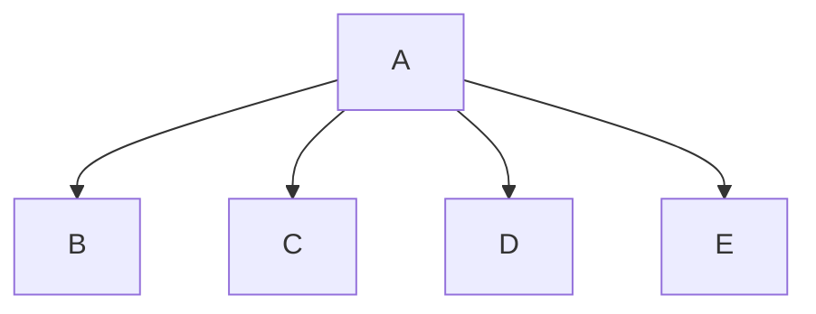

# Finals Project
Sam Peterman

## <fianls project> this is a game where a weary traveler explores the lands of Agartha
You input your name and select what class you would like to be. Then you are preseneted with 3 roads and you select one. 1 of the roads you are presenet with a monster and the other 2 you either live peacefully in a valley or get swept away in a river.

### <program_name> Flowchart

#### Function Diagrams

| `final`    |               |  Sam Peterman     |
| ------------------ | ------------- | ------------ |
| `argument:type`    | prints a intro to the game  |        
| `time:integer`     | puts function for name class and place  |
| `name:string`     
***
| `name`    |               |     Sam Peterman   |
| ------------------ | ------------- | ------------ |
| `argument:type`    | opens file for names  | takes input for name              
| `time:integer`     | outputs name  | closes file |
| `name:string`      

| `classes`    |               |     Sam Peterman   |
| ------------------ | ------------- | ------------ |
| `argument:type`    | Gives player option for 3 classes  | Askes player for input for one of 3 classes |            
| `time:integer`     | outputs weapon  | 
| `name:string`

| `places`    |               |     Sam Peterman   |
| ------------------ | ------------- | ------------ |
| `argument:type`    | print 3 different roads   | takes input for which road the player would like to take |              
| `time:integer`     | directs player to code based on path they picked  |  |
| `name:string`

| `m_r`    |               |     Sam Peterman   |
| ------------------ | ------------- | ------------ |
| `argument:type`    | prints introduction for file  | gets random number for monster health|            
| `time:integer`     | print monster health  | ask input for player to attack monster | | player keeps attacking monster until monster 0 health |
| `name:string`      | askes for input if player would like to play again |

| `b_e_y`    |               |     Sam Peterman   |
| ------------------ | ------------- | ------------ |
| `argument:type`    | prints introduction to place  | outputs to player that they win |              
| `time:integer`     | askes for input if player would like to play again  |
| `name:string`

| `b_h_r`    |               |     Sam Peterman   |
| ------------------ | ------------- | ------------ |
| `argument:type`    | prints introduction to place  | outputs to player that they lose |          
| `time:integer`     | askes for input if player would like to play again  | 
| `name:string`
***
